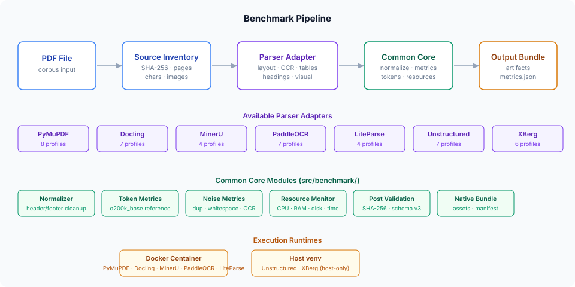
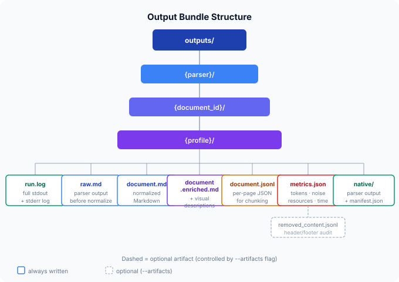

# Document AI Benchmark

A local, reproducible benchmark framework for evaluating PDF document parsing pipelines for RAG (Retrieval-Augmented Generation) ingestion. It runs each parser in strict isolation, measures a broad set of text-quality and resource metrics, and produces a standardized output bundle per parser/document/profile combination.

---

## Why this exists

A 1,000-page corporate PDF should not be sent directly to a cloud LLM. The goal is to parse it once — locally — transform it into searchable structured content, index it, and send only a small number of relevant chunks to the cloud. This project answers: **which local parser does that best?**

The benchmark is **not** a ground-truth comparison (no human-annotated gold standard). It is a reproducible engineering comparison of extraction quality signals, resource costs, and structural fidelity across multiple parsers and profiles.

---

## Pipeline



Every benchmark run follows the same four-stage pipeline regardless of which parser is used:

| Stage | Module | What happens |
|---|---|---|
| **Source Inventory** | `src/benchmark/source_inventory.py` | Objective, parser-agnostic PDF measurement — SHA-256, page count, native character count, embedded images, vector drawings. Run once before any parsing. |
| **Parser Adapter** | `src/parsers/*_v2.py` | Parser-specific subprocess. Handles layout analysis, OCR, table extraction, visual enrichment. Produces a `ParserArtifactInput`. |
| **Common Core** | `src/benchmark/artifacts.py` | Normalization, noise metrics, token metrics, resource accounting, audit trail. Identical for every parser. |
| **Output Bundle** | `src/benchmark/paths.py` | Atomic writes to a deterministic directory tree. Validated against schema v3. |

---

## Parsers & Profiles

Seven parsers are integrated. Each has multiple named profiles that control OCR mode, DPI, threading, model variant, and visual enrichment:

| Parser | Runtime | Profiles | Key capabilities |
|---|---|---|---|
| **PyMuPDF** (`pymupdf`) | Docker | 8 | Native text, layout analysis, selective OCR via RapidOCR + Tesseract, SmolVLM visual enrichment |
| **Docling** (`docling`) | Docker | 7 | Deep layout analysis, TableFormer v1/v2, SmolVLM picture description, RapidOCR, Granite Chart v4 |
| **MinerU** (`mineru`) | Docker | 4 | Academic-grade PDF parsing, formula detection, per-page structured JSON |
| **PaddleOCR** (`paddleocr`) | Docker | 7 | PP-StructureV3 document pipeline, table/figure/text region detection |
| **LiteParse** (`liteparse`) | Docker | 4 | API-based parsing with OCR merge logic and SmolVLM visual descriptions |
| **Unstructured** (`unstructured`) | Host venv | 7 | Element-level extraction, hi-res table mode, spaCy-backed model manifest |
| **XBerg** (`xberg`) | Host venv | 6 | Structured extraction with QR code detection as derived content |

Profiles are defined in [`config/benchmark_profiles.json`](config/benchmark_profiles.json) (schema version 3). The `full_cpu_local` profile is the standard cross-parser comparison profile for each parser.

---

## Quick Start

### Prerequisites

- Docker Desktop (or Docker Engine on Linux)
- Python 3.12+ with a virtual environment for host-only parsers
- Tesseract 5+ with `por` and `eng` language packs
- Input PDFs in `data/raw/batch/`

### Run the full benchmark

```bash
# Dry-run: see what would execute without running anything
python scripts/run_batch.py --dry-run

# Run all parsers with the full_cpu_local profile (smoke suite)
python scripts/run_batch.py --suite smoke

# Run a specific parser and profile
python scripts/run_batch.py --parser pymupdf --profile ocr_auto_rapidtess

# Resume an interrupted run (skips completed jobs)
python scripts/run_batch.py --resume

# Show a plan without executing
python scripts/show_benchmark_plan.py
```

### Preflight check

```bash
# Verify a parser is ready to run (models, packages, tesseract)
python scripts/parser_preflight.py --parser pymupdf --profile full_cpu_local
```

### Build comparison reports

```bash
# Cross-parser comparison table
python scripts/build_parser_comparison.py

# Per-parser summary
python scripts/build_pymupdf_summary.py
python scripts/build_docling_summary.py
python scripts/build_mineru_summary.py
```

---

## Output Bundle



Every run produces a directory at `outputs/{parser}/{document_id}/{profile}/` containing:

| File | Always written | Description |
|---|---|---|
| `run.log` | ✅ | Full stdout + stderr of the parser subprocess |
| `document.md` | ✅ | Normalized Markdown (headers/footers removed) |
| `raw.md` | optional | Parser output before any normalization |
| `document.enriched.md` | optional | Normalized Markdown with visual descriptions inserted |
| `document.jsonl` | optional | Per-page structured JSON for downstream chunking |
| `metrics.json` | optional | Full metrics record (schema v3) |
| `removed_content.jsonl` | optional | Audit trail of every removed header/footer line |
| `native/` | optional | Parser-native bundle with asset copies and manifest |

Use `--artifacts` to control which files are written:

```bash
python scripts/run_batch.py --artifacts all          # everything
python scripts/run_batch.py --artifacts document.md,run.log  # minimal
```

### metrics.json schema v3

Every `metrics.json` follows schema version 3. Key sections:

```jsonc
{
  "schema_version": 3,
  "parser": "pymupdf",
  "profile": "full_cpu_local",
  "document_id": "...",

  // Objective PDF properties (parser-agnostic)
  "source_inventory": { "pages": 25, "sha256": "...", "native_chars": 42000, ... },

  // Token counts using tiktoken o200k_base
  "tokens": {
    "reference": { "raw": 12400, "clean": 11200, "reduction_percent": 9.7 }
  },

  // Text quality signals
  "noise": { "duplicate_line_ratio": 0.02, "replacement_character_ratio": 0.0, ... },

  // Markdown structure counts
  "content": { "headings": 38, "tables": 12, "list_items": 94, ... },

  // Process-tree resource consumption
  "resources": {
    "monitor_version": "process_tree_v2",
    "wall_time_seconds": 47.3,
    "peak_rss_mb": 812,
    "process_cpu_time_seconds": 143.1,
    ...
  }
}
```

---

## Key Concepts

### Source Inventory vs Parser Output

The **Source Inventory** is objective: it measures what is physically inside the PDF (native character count, embedded images, vector drawing groups). It is computed once before any parser runs and never changes.

The **Parser Output** is semantic: a parser may classify a vector region as a `picture`, a `chart`, or a `table`. Two parsers can produce different structural counts from the same PDF without either being wrong — they are applying different classification models.

These two measurement types must never be conflated.

### Normalization

After parsing, a common normalizer removes **repeated headers and footers** using frequency analysis across pages. A line is removed if it appears on more than 30% of pages (minimum 3 pages). Page number patterns are replaced with a `<page-number>` key. Every removed line is recorded in `removed_content.jsonl` for auditing.

Normalization runs identically for every parser — differences in `document.md` reflect the parser, not the normalizer.

### OCR Strategy

Parsers that support OCR use **automatic selective OCR** by default: OCR is applied only to pages where the native text layer is absent or insufficient. This avoids re-running expensive OCR over pages that already contain accurate text.

The reference tokenizer is always **tiktoken `o200k_base`** — a stable, model-independent unit for cross-parser token comparison.

### Resource Monitoring

Every parser is monitored via `process_tree_v2`, which follows the root process and all its child processes. Document AI libraries often launch additional runtimes (ONNX, Java, etc.), so monitoring only the top Python PID would severely under-report actual consumption.

### Resume & Locking

`run_batch.py` uses file-based locking to prevent concurrent runs. Completed jobs are validated post-execution (SHA-256, schema version, artifact coverage). `--resume` skips jobs whose outputs pass validation.

### Visual Enrichment

Parsers with `visual_enrichment` enabled (PyMuPDF `full_cpu_local_visual`, Docling `ocr_auto_visual`, LiteParse `ocr_auto_visual`) use a long-running SmolVLM subprocess (`src/enrichment/visual_worker.py`) that loads the model once and serves description requests over a JSON stdin/stdout protocol.

---

## Directory Layout

```
document-ai-benchmark/
├── config/
│   ├── benchmark_profiles.json     # All parser profiles (schema v3)
│   └── runtime_campaign.json       # Multi-phase campaign definition
├── data/
│   ├── benchmark_manifest.md       # Document descriptions
│   └── raw/batch/                  # Input PDFs
├── docker/
│   └── {parser}/                   # Dockerfile + requirements.txt per parser
├── docs/
│   └── assets/                     # SVG diagrams
├── fixtures/
│   └── deep_smoke/                 # Synthetic test PDF + manifest
├── models/                         # Local model weights (not in git)
├── outputs/                        # Benchmark run results (gitignored)
├── parser_tests/
│   └── {parser}/                   # Per-parser integration test suites
├── scripts/
│   ├── run_batch.py                # Main orchestrator (1,949 lines)
│   ├── parser_preflight.py         # Pre-run readiness checks
│   ├── build_*_summary.py          # Per-parser summary builders
│   ├── build_parser_comparison.py  # Cross-parser comparison table
│   ├── evaluate_pymupdf_dpi.py     # DPI ablation study
│   ├── generate_*.py               # Fixture generators
│   ├── probe_*.py                  # API exploration scripts
│   └── validate_*.py               # Model and regression validators
├── src/
│   ├── benchmark/                  # Common core (normalizer, metrics, paths, …)
│   ├── enrichment/                 # SmolVLM visual worker + client
│   ├── evaluation/                 # CER/WER OCR quality metrics
│   └── parsers/                    # Parser adapters (*_v2.py) + baselines
└── tests/                          # Unit and integration tests (pytest)
```

---

## Development Environment

| Component | Recommended |
|---|---|
| OS (dev) | Windows 11 + WSL2 + Ubuntu 22.04, or Linux |
| OS (server) | Windows Server 2025 (native) or Linux VM |
| Container runtime | Docker Desktop (dev) / Docker Engine (server) |
| Python | 3.12 |
| GPU | Optional — all profiles have CPU fallback |

All model weights are loaded from local directories. Network access is blocked during benchmark runs (`HF_HUB_OFFLINE=1`, `TRANSFORMERS_OFFLINE=1`).

### Running the test suite

```bash
# Main test suite
python -m pytest tests/ -q

# Per-parser integration tests (requires parser environment)
python scripts/run_parser_tests.py --parser pymupdf
```

---

## Docs

Detailed operational guides are in [`docs/`](docs/):

| Document | Purpose |
|---|---|
| [`benchmark_methodology.md`](docs/benchmark_methodology.md) | Measurement philosophy and metric interpretation |
| [`COMMAND_REFERENCE.md`](docs/COMMAND_REFERENCE.md) | Full CLI reference for all scripts |
| [`RUNTIME_VALIDATION_RUNBOOK.md`](docs/RUNTIME_VALIDATION_RUNBOOK.md) | Runbook for validating a new runtime environment |
| [`WINDOWS_HOST_AND_WSL_EXECUTION_GUIDE.md`](docs/WINDOWS_HOST_AND_WSL_EXECUTION_GUIDE.md) | Running host-only parsers on Windows/WSL2 |
| [`WINDOWS_SERVER_HOST_STATUS.md`](docs/WINDOWS_SERVER_HOST_STATUS.md) | Windows Server 2025 native runtime status |
| [`GUIA_REPRODUCAO_BENCHMARK_CONTROLADO.md`](docs/GUIA_REPRODUCAO_BENCHMARK_CONTROLADO.md) | Step-by-step controlled benchmark reproduction guide |
